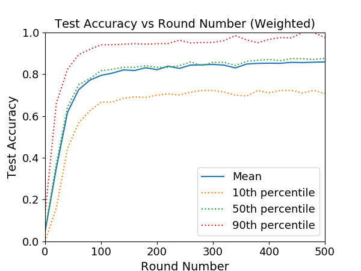
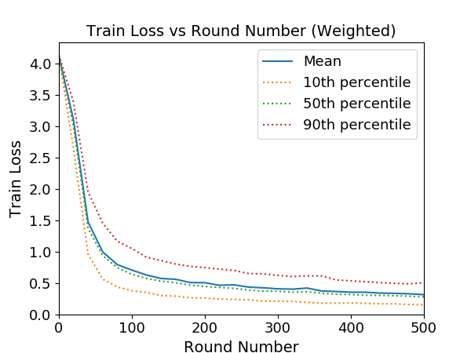
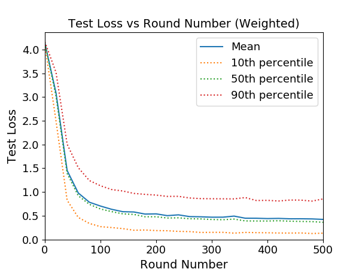
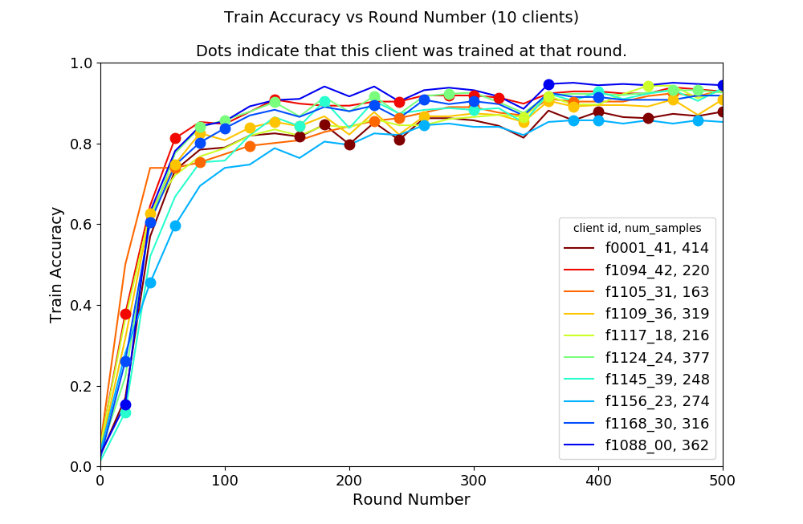
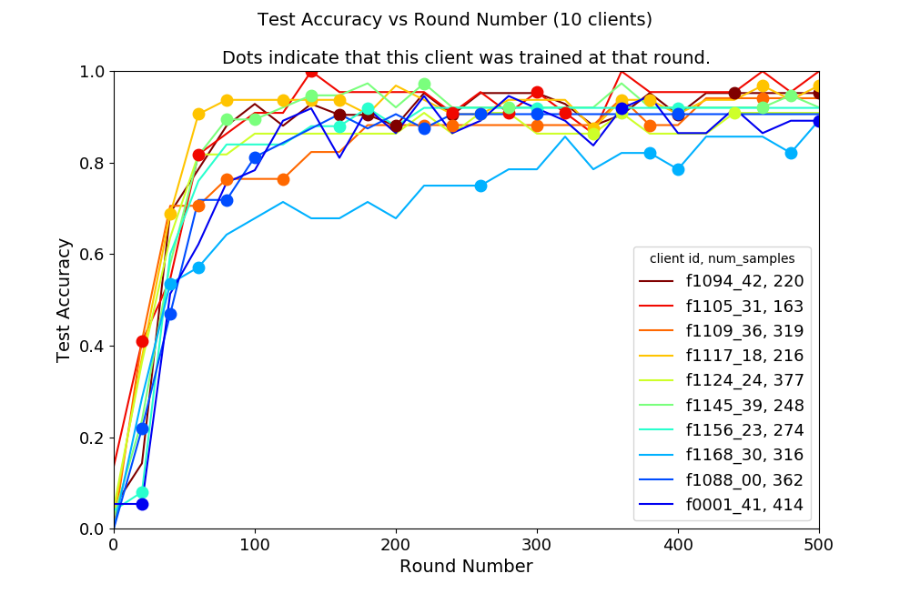
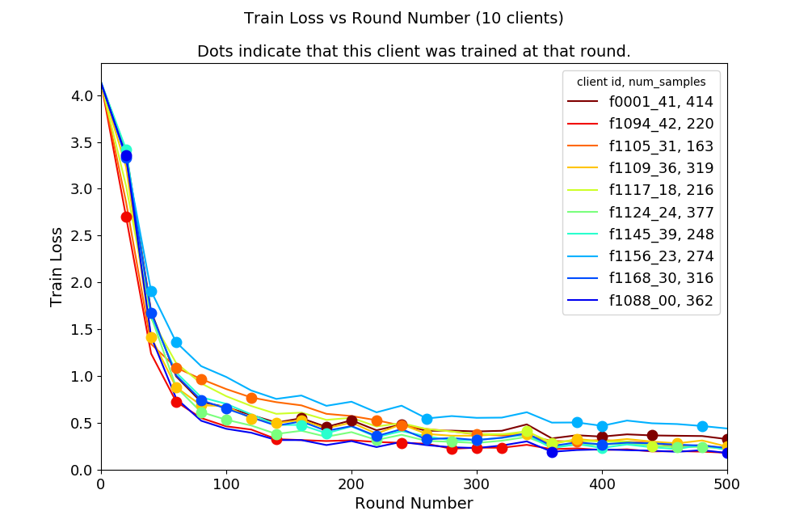
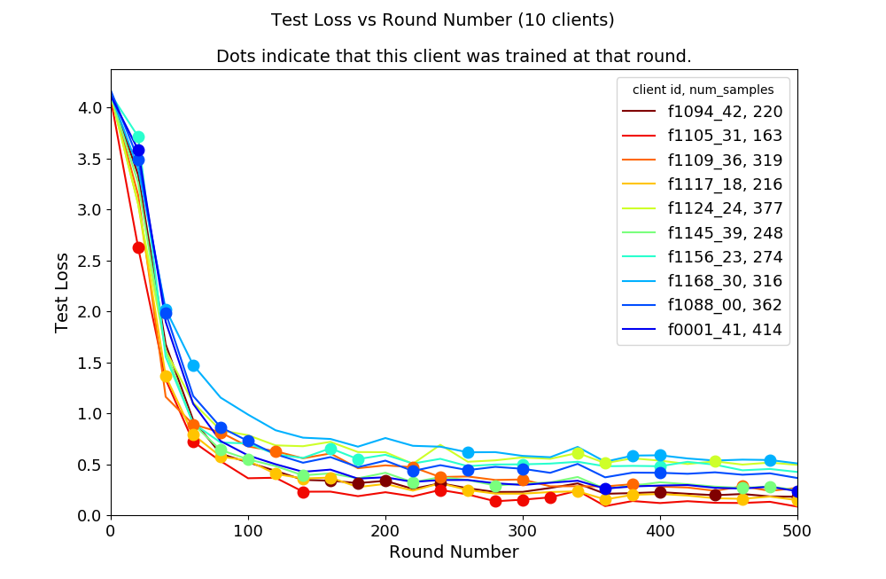
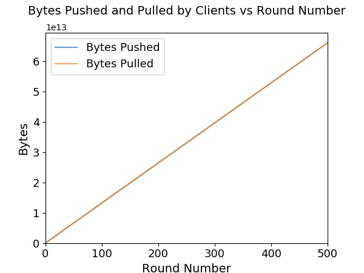
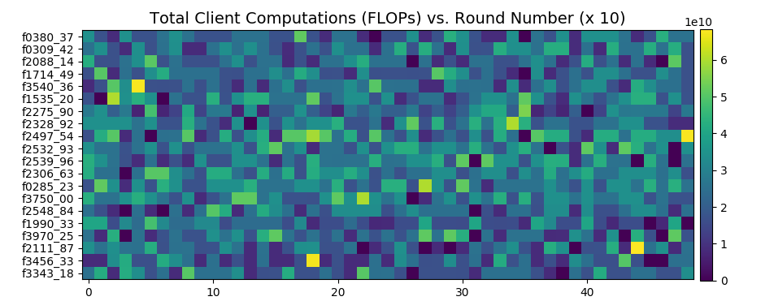

# FedMix: Mixed Frequency Federated Learning with Approximately I.I.D Sampling

## Note

* Go to directory of respective dataset for instructions on 
generating data.

* Docker is required to run this demo.

* To avoid the efficiency bottleneck caused by high-frequency data IO
(disk → CPU memory → GPU memory), the full dataset is loaded into GPU
memory, so small datasets are preferred in simulation.

* To reduce memory usage, clients share a client model, middle servers
share a server model and a merged update, and the top server owns a 
server model and a merged update. (5 models in total.)

* Both the output log and the trained model are stored in 
``logs/{DATASET}/{CONTAINER_RANK}/``.

## Installation

Enter the ``scripts`` directory and use ``scripts/build-env.dockerfile`` 
to build the image ``fedmix:mxnet1.4.1mkl-cu101-py3.7``:

> sudo docker build -f build-env.dockerfile -t fedmix:mxnet1.4.1mkl-cu101-py3.7 .

Run ``scripts/run.sh`` to create a container ``fedmix.{CONTAINER_RANK}`` 
and start the simulation:

> chmod a+x run.sh && ./run.sh

``CONTAINER_RANK`` is an integer defined in ``scripts/run.sh``.

## Instruction

Default values for hyper-parameters are set in ``utils/args.py``, 
including:

| Variable Name | Default Value | Optional Values | Description |
|---|---|---|---|
| -dataset | "femnist" | "femnist" | Dataset used for federated training. |
| -model | "cnn" | "cnn" | Neural network used for federated training. |
| --num-rounds | 500 | integer | Number of rounds to simulate. |
| --eval-every | 20 | integer | Evaluate the federated model every few rounds. |
| --num-groups | 10 | integer | Number of groups. |
| --clients-per-group | 10 | integer | Number of clients trained per group. |
| --batch-size | 5 | integer | Number of training samples in each batch. |
| --num-syncs | 50 | integer | Number of local epochs in each round. |
| -lr| 0.01 | float | Learning rate for local optimizers. |
| --seed | 0 | integer | Seed for random client sampling and batch splitting. |
| --metrics-name | "metrics" | string | Name for metrics file. |
| --metrics-dir | "metrics" | string | Directory for metrics files. |
| --log-dir | "logs" | string | Directory for log files. |
| --log-rank | 0 | integer | Identity for current training process (i.e., ``CONTAINER_RANK``). Log files will be written to ``logs/{DATASET}/{CONTAINER_RANK}/`` (e.g., ``logs/femnist/0/``) |
| --use-val-set | None | None | Set this option to use the validation set, otherwise the test set is used. |
| -ctx | -1 | integer | Device used for simulation. -1 for CPU and 0~7 for GPUs.

Some commonly used hyper-parameters can also be set through 
``scripts/run.sh``, including:

| Environment Name | Variable Name | Description |
|---|---|---|
| CONTAINER_RANK | --log-rank | This will run a container named ``fedmix.{CONTAINER_RANK}`` and write log files to ``logs/{DATASET}/{CONTAINER_RANK}/``. |
| BATCH_SIZE | --batch-size | Same as the above table. |
| LEARNING_RATE | -lr | Same as the above table. |
| NUM_GROUPS | --num-groups | Same as the above table. |
| CLIENTS_PER_GROUP | --clients-per-group | Same as the above table. |
| NUM_SYNCS | --num-syncs | Same as the above table. |
| NUM_ROUNDS | --num-rounds | Same as the above table. |
| DATASET | -dataset | Same as the above table. |
| MODEL | -model | Same as the above table. |
| EVAL_EVERY | --eval-every | Same as the above table. |

Other required environment variables are:

| Environment Name | Default Value | Description |
|---|---|---|
| NUM_GPU_AVAILABLE | 2 | The number of GPUs available. |
| NUM_GPU_BEGIN | 0 | The index of the first GPU available. |
| IMAGE_NAME | fedmix:mxnet1.4.1mkl-cu101-py3.7 | Name of the basic image to be used. |
| CONTAINER_NAME | fedmix.{CONTAINER_RANK} | Name of the container created. |
| HOST_NAME | fedmix.{CONTAINER_RANK} | Hostname of the container. |
| USE_GPU | (auto) | Index of the GPU device used for simulation. This is set automatically thourgh {NUM_GPU_BEGIN} + {CONTAINER_RANK} % {NUM_GPU_AVAILABLE}. |

We recommend to mount files from the host computer into the container, 
modify ``scripts/run.sh`` and change the file path ``/home/lizh/fedmix`` 
to your own path.

## Results and Visualization

Using the default setting, we got the average test accuracy 0.859068 
and the average test loss 0.421488.

> tail -n 5 logs/femnist/0/output.0

```
--- Round 500 of 500: Training 100 clients ---
train_accuracy: 0.889864, 10th percentile: 0.824132, 50th percentile: 0.898551, 90th percentile 0.956957
train_loss: 0.311822, 10th percentile: 0.150281, 50th percentile: 0.275272, 90th percentile 0.502621
test_accuracy: 0.859068, 10th percentile: 0.707021, 50th percentile: 0.876524, 90th percentile 0.976016
test_loss: 0.421488, 10th percentile: 0.131551, 50th percentile: 0.360824, 90th percentile 0.852479
```

Tools in ``metrics/visualization_utils.py`` can be used for 
visualization. The example ``metrics/visualize.py`` reads metrics 
logs from ``metrics/metrics_stat.csv`` and ``metrics/metrics_sys.csv``, 
and plot curves of accuracy, bytes pushed and pulled, and flops 
of clients.













<div align="center">

<div align="center">

Longest FLOPs path: 4.29E+12